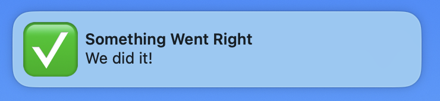

# Teller

This is extremely silly, but hey! 

Trying to make a simple app/script that does nothing but notify success or failure from the command line. 

```bash
teller success --message "We did it!" --title "Something Went Right" --sound Glass
```


```bash
teller failure --message "Oh no, this is bad." --title "Disaster strikes!!" --sound Basso
```


Along the lines of [`terminal-notifier`](https://github.com/julienXX/terminal-notifier/), but I wanted to see if there was some way I could get specific images to show up. `terminal-notifier` used to have functionality to pass an image path that would appear as the app icon, but that was using some private framework and [stopped working with Big Sur (macOS 11)](https://github.com/julienXX/terminal-notifier/issues/283).

Of course, like any good programmer, once I had 2 of something ("✅ success" and "❌ failure"), I wanted _N_ of that thing, so I set up this wacky build system deal with arbitrary emojis. 

This generates a set of *whole different apps*, each with its own icon to send different notifications. The [`builds.json`](./builds.json) shows how to specify emoji and labels. It also lets you set a directory to install a wrapper script to make it a little easier from the command line. Examples below. 

No pre-built artifacts because of codesigning and notarization. Short version: notifications require per-identifier permissions, but that means each identifier has to be registered with a developer account if it wants to do anything more than run on the machine that built it. So you gotta build these yourself. Sorry. Take it up with Apple. 

## Installation

Assuming you have Xcode and [Deno](https://deno.com/) installed...

1. Edit [`/builds.json`](./builds.json) to your liking. 
   * `usr_bin`: sets a directory where the install script will put the `teller` wrapper. 
   * `code_signature`: defaults to `-`, which just gives you ad-hoc signing, no good for distribution. Put your key in here if you need to codesign more officially for whatever reason. The ad-hoc one should run just fine on the machine that built it, though every time you rebuild, it will complain; if this bothers you, put in a real signing key. 
   * `builds`: an array of objects with an `emoji` and a `label`. If you put more than one emoji in there, behavior is undefined. It works with most of the combined emojis I've tried, but who knows what the limitations might be. I keep it simple, here. 
2. Run `./scripts/_build.sh`
   * Creates multiple "Teller" apps in the `build` directory, each one with a different icon and bundle identifier. 
3. Run `./scripts/_install.sh`
   * Moves each of the built apps into `$HOME/Applications/tellers` and puts the wrapper script into your `usr_bin`. 
4. The first time you run the command-line (or double-click the app and test a notification) you 
will be prompted to approve the permissions. If the app is ad-hoc signed, you'll also get a complaint from the OS. After that, though, they should run without a hitch. (They show up in the Notifications area of your Settings app if you want to review or remove their permissions.)

Then, assuming the `usr_bin` is somewhere on your $PATH, from the command line you can say:

```bash
teller success --message "Awesome Work" --title "What a Great Thing" --delay 1.0 --sound Glass
```

Arguments go:
* `[label]`: which of the Teller apps to call and thus which icon will show up in the notification. Must match up with one of the labels from your `builds.json` file. (`success`, in this example)
* `--message`: the body of the notification. Required.
* `--title`: the title of the notification. Default: "Teller Notification"
* `--delay`: floating point number of seconds to wait before popping notification. Must be greater than zero (macOS rule). Default: 0.1
* `--sound`: optional name of system sound to play. Default: &lt;nil&gt;; must be one of (Basso, Blow, Bottle, Frog, Funk, Glass, Hero, Morse, Ping, Pop, Purr, Sosumi, Submarine, Tink)

(The build uses Deno instead of my usual Python because, strangely enough, there are not Python libraries that can easily extract the raw PNG data from the Emoji font. I could have gone down the rabbit hole of parsing it myself but there was already a JavaScript solution and I like how Deno makes it easy to run without a whole setup. Anyway.)
